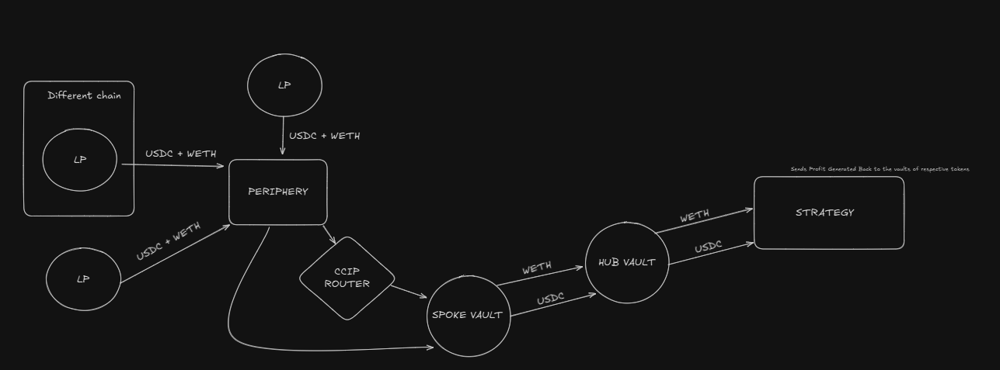

# [NAME WILL COME SOON]

This repository features projects implementing a HUB & SPOKE model for cross-chain token transfers, profit generation from token swaps, and perpetual trading using Uniswap V3/V4 and AAVE. It also leverages Chainlink's automation for automatic profit extraction and distribution among liquidity providers (LPs).

Initially planning to only use two tokens WETH and USDC.
